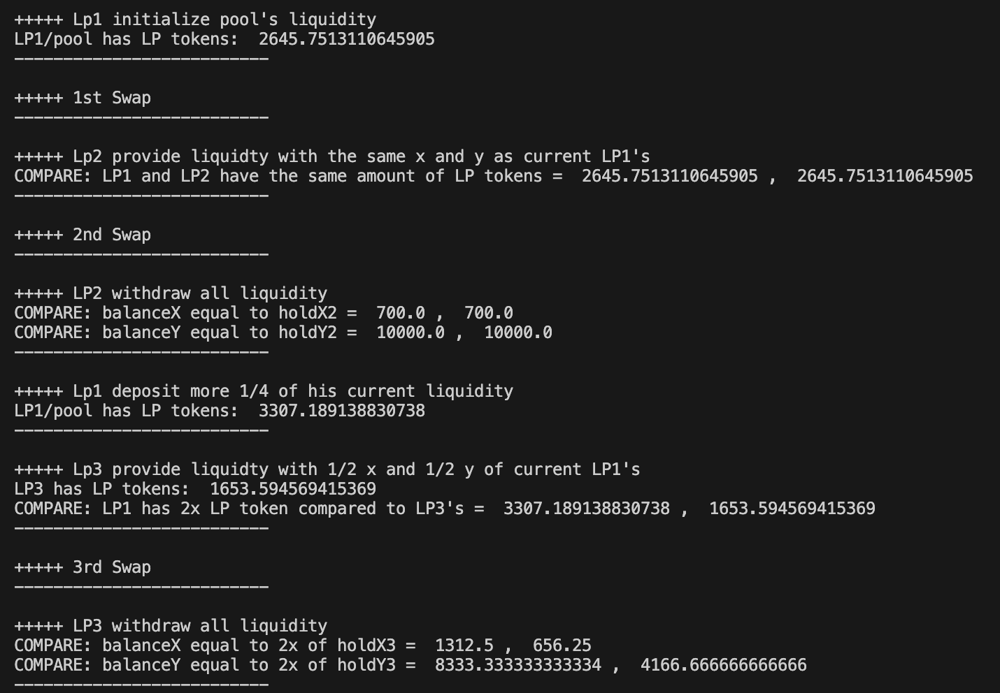

# LP-Accounting-DPAMM-CPAMM

This repo contains a minimal proof of the concept showcasing how DPAMM handles liquidity contribution accounting, compared to CPAMM.

## Objective

DPAMM should handle liquidity contribution and net total of each liquidity position correctly like CPAMM. The model calculates liquidity seaprately (LPX and LPY), since liquidity provision is asymmetrical and position-independent. Combining LPX and LPY, the result should yield the exact same result as liquidity(k) in CPAMM.

## Environment

- We assume no trading fees in the calculation, keeping the constant(K) after each trade stable.
- There are only three liquidity providers in the pool, and each of them contributes their liquidity at different a time interval.
- Each of liquidity providers has to withdraw liquidity at a different interval.
- There are swaps happen in between liquidity deposits and withdrawals.

## What we did

1. The pool is initalized by LP1, the first liquidity provider. He will get LPX1 and LPY1.
2. A swap occurs to drive the price of X upwards.
3. LP2 deposits to the liquidity pool, with the same current value of LP1.
4. Another swap occurs, bringing the price of X to the original.
5. LP2 withdraw his entire liquidity.
6. LP1 add more liquidity to the pool.
7. LP3 deposits to the liquidity pool, with the half of current value of LP1 in both LPX and LPY.
8. A swap occurs, driving the price of X downwards.
9. LP3 withdraw the liquidity entirely, left LP1 in the pool alone.
10. Do all the above again in CPAMM, then compare the results. If identical, it passes.

## Result Summary

lpCPAMM.py

## Guide

Clone this repository
`git clone https://github.com/Ax11-Labs/LP-Accounting-DPAMM-CPAMM.git`

Go to the downloaded repo, make sure you have [Python3](https://www.python.org/downloads/) on your computer.

Define your file path in `./test/tLpCPAMM.py` and `./test/tLpDPAMM.py` by changing the value in this line: `sys.path.insert(0,'/DEFINE-YOUR-PATH-HERE/LP-Accounting-DPAMM-CPAMM/src') # add your path`

Run the following command in terminal:
`python3 ./test/tLpCPAMM.py`

Adjust the value within the `./src/tCPAMM.py` and `./src/tDPAMM.py` as you like for more experiments.

## Use and Contribution

This repository is made open-source with the MIT license. In short, feel free to do whatever you want.
